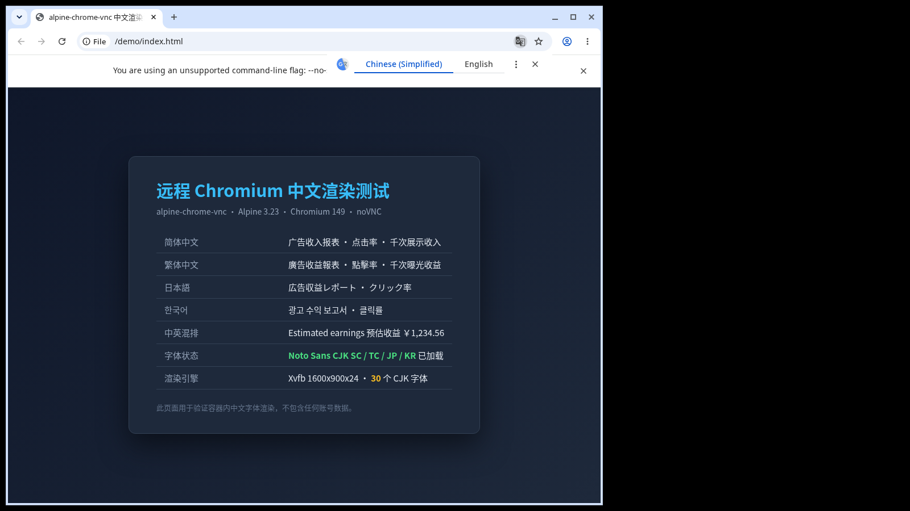

# alpine-chrome-vnc

[](https://github.com/mylastfree/alpine-chrome-vnc/actions/workflows/build.yml)
[](https://github.com/mylastfree/alpine-chrome-vnc/pkgs/container/alpine-chrome-vnc)
[](https://github.com/mylastfree/alpine-chrome-vnc/pkgs/container/alpine-chrome-vnc)
[](https://alpinelinux.org/)
[](https://www.chromium.org/)
[](LICENSE)

Ultra-lightweight remote Chromium container on Alpine Linux, tuned for small VPS instances (1 vCPU / 1 GB RAM).

Access a full desktop Chromium from any browser over noVNC — with CJK font support and bidirectional clipboard.

## Screenshot



Chromium 149 rendering CJK content inside the container — Simplified/Traditional Chinese,
Japanese, Korean, and mixed CJK+Latin, all via Noto Sans CJK.
## Why this exists

Popular remote-browser images carry a lot of framework overhead that hurts on tiny VPS:

| Image | Size | Runtime RAM | Framework overhead |
|---|---|---|---|
| `linuxserver/chrome` | 3.21 GB | 367 MB | python3 (Selkies/WebRTC) 168 MB + labwc 100 MB |
| `kasmweb/chrome` | 1.36 GB | heavy | full Kasm workspace |
| **alpine-chrome-vnc** | **1.2 GB** | **~235 MB** | websockify 7.3 MB + x11vnc 5.6 MB |

Chromium itself only needs ~100 MB — the rest is the remote-desktop stack.
This project replaces Selkies/WebRTC + Wayland with plain **X11 + x11vnc + noVNC**.

Result: **63% smaller image**, **~36% less RAM**, same functionality.

## Features

- **Alpine 3.23** base — 8.4 MB, 1.2 GB final image
- **Chromium 149** (Alpine musl build)
- **CJK fonts** — Noto CJK, 30 fonts, UI language `--lang=zh-CN`
- **Bidirectional clipboard** — `autocutsel` syncs X11 CLIPBOARD ↔ PRIMARY, works through noVNC
- **No client needed** — open `http://<host>:6080/vnc.html` in any browser
- **Low-end device mode** — `--enable-low-end-device-mode` trims RAM further
- **supervisord** — 7 managed processes, auto-restart on failure
- **Tiny footprint** — Xvfb 258 MB virt / x11vnc 33 MB / websockify 7 MB

## Pull from a registry

Prebuilt multi-arch images are published to GHCR on every push to `main`:

```bash
docker pull ghcr.io/mylastfree/alpine-chrome-vnc:latest

docker run -d --name chrome-lite \
  --restart unless-stopped \
  -e TZ=Asia/Shanghai \
  -e VNC_PASSWORD=change-me-please \
  -e START_URL=https://example.com \
  -p 6080:6080 \
  -v "$PWD/config:/root/.config" \
  --shm-size=256m --memory=600m --memory-swap=1000m \
  ghcr.io/mylastfree/alpine-chrome-vnc:latest
```

Or with docker-compose:

```yaml
services:
  chrome:
    image: ghcr.io/mylastfree/alpine-chrome-vnc:latest
    # ... same environment / ports / volumes as below
```

Tagged releases (`v*`) also publish `:<version>` and `:<major>.<minor>`.

### Docker Hub (optional)

The `publish-dockerhub` job is opt-in. To enable it, add repository secrets
`DOCKERHUB_USERNAME` + `DOCKERHUB_TOKEN` and set the repository variable
`DOCKERHUB_ENABLED` to `true` (Settings → Secrets and variables → Actions).
## Quick start

### docker-compose (recommended)

```yaml
services:
  chrome:
    build: .
    image: chrome-alpine:latest
    container_name: chrome-lite
    restart: unless-stopped
    environment:
      TZ: Asia/Shanghai
      SCREEN_WIDTH: "1600"
      SCREEN_HEIGHT: "900"
      VNC_PASSWORD: change-me-please
      START_URL: https://example.com
    ports:
      - "6080:6080"
    volumes:
      - ./config:/root/.config
    shm_size: 256m
    mem_limit: 600m
    memswap_limit: 1000m
```

```bash
docker compose up -d --build
```

### docker run

```bash
docker build -t chrome-alpine .

docker run -d --name chrome-lite \
  --restart unless-stopped \
  -e TZ=Asia/Shanghai \
  -e SCREEN_WIDTH=1600 -e SCREEN_HEIGHT=900 \
  -e VNC_PASSWORD=change-me-please \
  -e START_URL=https://example.com \
  -p 6080:6080 \
  -v "$PWD/config:/root/.config" \
  --shm-size=256m \
  --memory=600m --memory-swap=1000m \
  chrome-alpine
```

Then open **`http://<your-host>:6080/vnc.html`** and enter `VNC_PASSWORD`.

## Configuration

| Variable | Default | Description |
|---|---|---|
| `SCREEN_WIDTH` | `1600` | Virtual display width |
| `SCREEN_HEIGHT` | `900` | Virtual display height |
| `SCREEN_DEPTH` | `24` | Colour depth |
| `VNC_PASSWORD` | *(none)* | VNC password. **Always set this.** |
| `START_URL` | `https://adsense.google.com` | Page opened on launch |
| `TZ` | `America/New_York` | Container timezone |

## Measured performance

Tested on a 1 vCPU / 1 GB RAM KVM VPS (AMD EPYC-Milan), Chromium 149:

| Metric | Value |
|---|---|
| Container RAM (blank page) | 303 MB |
| Container RAM (heavy SPA) | 235–335 MB |
| Image size | 1.2 GB |
| noVNC reachable | HTTP 200 |
| Clipboard round-trip | verified (`xclip` write → read back) |

### CPU depends on the page you open, not on this container

| Page | Container CPU |
|---|---|
| `about:blank` | **0.26%** |
| `https://www.example.com` | **0.20%** |
| `https://adsense.google.com` | **14%** |

Chromium in this container idles at well under 1% CPU. Heavy SPAs (analytics dashboards,
ad consoles) burn CPU inside the page itself — no container image can avoid that.

**Tip:** `docker stop chrome-lite` when idle. RAM drops to zero and CPU to 0%.

## Architecture

```
Alpine 3.23
└─ supervisord
   ├─ Xvfb            virtual X display (SCREEN_WIDTH x SCREEN_HEIGHT x 24)
   ├─ openbox         minimal window manager
   ├─ autocutsel x2   CLIPBOARD ↔ PRIMARY sync  →  bidirectional clipboard
   ├─ x11vnc          VNC server on :5900
   ├─ websockify      noVNC web bridge on :6080
   └─ chromium        the browser
```

## Security

**The default setup has no TLS.** noVNC traffic is plain HTTP. For anything beyond a
trusted LAN:

1. **SSH tunnel** (simplest, no exposed port):
   ```bash
   ssh -N -L 6080:127.0.0.1:6080 user@host
   # then browse http://localhost:6080/vnc.html
   ```
   Change the port mapping to `-p 127.0.0.1:6080:6080` so it never leaves the host.

2. **Reverse proxy with TLS** — put Caddy/nginx in front and terminate HTTPS.

3. **Cloudflare Tunnel** — expose through `cloudflared` with Access policies.

Also: never run this without `VNC_PASSWORD` set on a public interface.

## Notes

- `--no-sandbox` is required inside the container (no user namespaces available).
  Only run trusted content, or add a seccomp profile.
- Chromium may log harmless `dbus` / `gcm` errors — there is no D-Bus in the container.
- The Chromium profile lives in `/root/.config/chromium` (mount it to persist logins).
  `start.sh` clears stale `Singleton*` lock files on boot, which otherwise block
  startup after a container is recreated.

## License

MIT